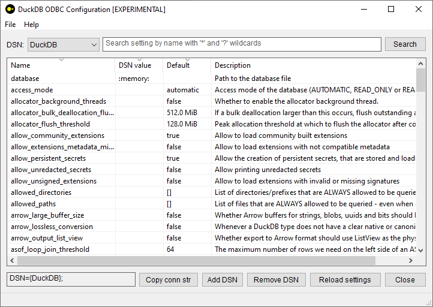
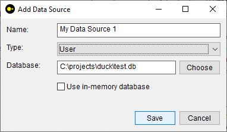
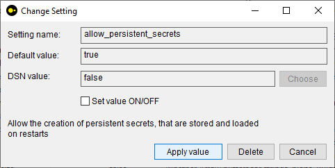

DuckDB ODBC Configuration Utility (EXPERIMENTAL)
------------------------------------------------

[DuckDB ODBC driver on Windows](https://duckdb.org/docs/stable/clients/odbc/windows.html) can be managed using `odbcad32.exe` system utility or directly using Windows Registry editor.

Configuration settings can be set as Registry values for the particular Data Source key. This utility provides an easy way to set Data Source settings. It includes the names and descriptions of all DuckDB settings available in [duckdb_settings() table function](https://duckdb.org/docs/stable/sql/meta/duckdb_table_functions.html#duckdb_settings) and allows to set them for the specified Data Source. It also allow to add or remove DuckDB Data Sources. It is intended to be used along with [DuckDB ODBC installer](https://github.com/staticlibs/duckdb-odbc-installer).

License information
-------------------

This project is released under the [Apache License 2.0](http://www.apache.org/licenses/LICENSE-2.0).

Copyright 2025, DuckDB Labs.